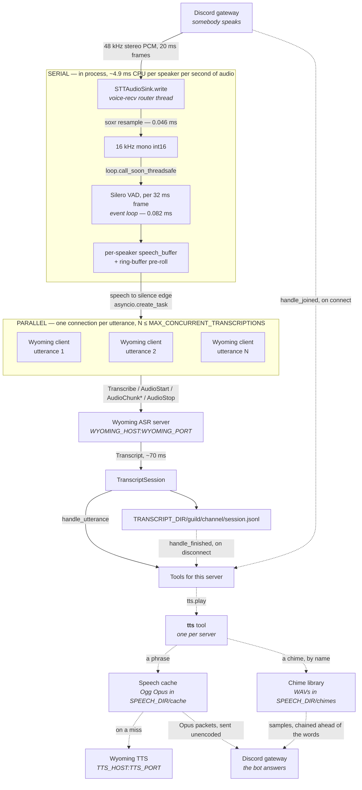

miss-quote is a Discord bot that sits in on your D&D session and listens to the adventures, so the evening ends up with a record instead of in everyone's half-memory of it. When the bot leaves it summarizes what happened, and next time you can ask: "what happened last session" and a bard recounts the night. It gets up to other shenanigans too.

Underneath that, it transcribes Discord voice channels to a per-session, per-speaker JSONL transcript and hands that result to tools. Transcription is delegated to a [Wyoming](https://github.com/rhasspy/wyoming) ASR server rather than run in-process, so **this container** is a CPU-only workload with no model weights and no cache volume for them.

**That moves the GPU rather than removing it.** The bot does nothing at all without a reachable ASR server, and a Wyoming ASR worth pointing it at wants a GPU; the same goes for the synthesizer behind anything said out loud, and for the endpoint behind a summary. Nothing here is a local-first, run-it-on-a-laptop design — the useful claim is narrower and still worth making: **the process that has to sit in a voice channel all evening is cheap and schedules anywhere, and the expensive hardware sits behind a socket where several things can share it.**

It is a hard fork of [Leehyunbin0131/Discord-Realtime-STT-Bot](https://github.com/Leehyunbin0131/Discord-Realtime-STT-Bot), which ran `faster-whisper` on a local GPU. Moving transcription to a network call removed the reason for most of the machinery around it — see [changes from upstream](#changes-from-upstream).

## How it works



The gateway is drawn at both ends because it is one connection: the channel the audio came from is the channel anything gets played back into.

The dotted half is optional and only exists for servers that enabled the `tts` tool; a deployment where none did never opens a TTS connection. Everything played into a channel goes through that one tool — it owns the cache, the chime library, the volume, and the voice connection, and the tools that decide *what* to say reach it through the toolbox.

Everything runs on one event loop in one process. The split that matters is between the two halves of the pipeline: **audio handling is local and serial, transcription is remote and parallel.**

### Local: serial, continuous, cheap

Resampling and VAD are ordinary blocking calls, run one frame at a time. They are a steady cost for as long as audio arrives, not a per-utterance burst — VAD has to see every frame, because VAD is what decides which frames are speech.

| Work | Cost | Rate, per speaker |
|---|---:|---|
| soxr resample, per 20 ms Discord frame | 0.046 ms | 50/s |
| Silero VAD, per 32 ms frame | 0.082 ms | 31.25/s |

That is **~4.9 ms of CPU per speaker per second of audio**, or about 0.5% of one core — 5% at ten concurrent speakers. Being serial costs nothing at this magnitude, which is why there is no worker process: a process boundary would cost more in serialization than the work it isolated.

Resampling runs on voice-recv's router thread, which holds a lock across all speakers, so nothing slow may be added there. Frames reach the event loop via `loop.call_soon_threadsafe`.

### Remote: parallel, bounded

At each speech-to-silence edge the buffered utterance is handed to `asyncio.create_task` and the coroutine immediately parks on socket I/O — the loop is free in the same tick. Nothing in this process ever blocks on transcription.

The ASR server accepts overlapping utterances, so speakers do not queue behind one another; measured against a GPU-backed Wyoming server, eight simultaneous 0.88 s utterances completed in 223 ms against 555 ms if run serially. A single utterance round-trips in about 70 ms.

`MAX_CONCURRENT_TRANSCRIPTIONS` caps how many are in flight. A further utterance ending while the cap is reached parks on the semaphore — it does not stall the loop and does not drop audio, it simply waits to open its connection. The bound exists so a busy channel cannot fan out unbounded connections against an ASR that other services may share; throughput gains past four are marginal anyway.

Upstream got this backwards: it called `transcribe()` inline in the per-frame loop, so the expensive remote half ran serially while audio backed up in a queue until frames were silently dropped.

## Transcript format

Transcripts are filed one directory per guild, one per voice channel inside it, and **one file per session** — one visit by the bot to one voice channel:

```
TRANSCRIPT_DIR/
└── first-server/
    ├── general-voice/
    │   ├── 2026-07-26T20-14-03.jsonl
    │   └── 2026-07-27T09-31-55.jsonl
    └── side-room/
        └── 2026-07-27T21-02-40.jsonl
```

A session opens when the bot joins and closes when it leaves — because the channel emptied, because someone disconnected it, or because the pod terminated. The file is named for the moment it opened and keeps that name until it closes, so **a conversation spanning midnight stays in one file** and **rejoining starts a new one**. A session that opens in the same second as another in the same channel gets a `-2` on the end rather than appending to it.

Rejoining is qualified by the **resume window** ([`settings.transcripts.resume_seconds`]({{ '/configuration/#transcripts' | relative_url }}), 5 s). A channel that empties and refills inside it is treated as one conversation with a gap in it — someone's client dropped, or the last person stepped away — so the transcript is held open and appended to rather than sealed and replaced.

The server directory is its **alias from `servers`**, fixed in configuration rather than read from Discord, so it cannot change underneath the tree. Channels use their Discord name.

Neither carries an ID, which has two consequences worth knowing. **Renaming a channel starts a new directory** with nothing tying it to the old one; that is accepted rather than worked around, since the alternative is an ID in every path to serve a rare event. And **two names that reduce to the same slug share a directory** — two servers given one alias, or two voice channels named `General` and `general`. Their sessions stay in separate files, but nothing in the tree says which file came from where. Nothing about the path can catch either, so the bot logs an error instead: duplicate aliases at startup, colliding channels when it joins one.

Names are lowercased and reduced to `a-z0-9_-`, which drops dots and separators rather than escaping them, so no name can express a path traversal wherever it appears in the string.

JSON Lines, one object per utterance, appended and flushed as produced:

```json
{"ts":"2026-07-26T21:14:03.412-07:00","user_id":1234567890,"user":"someone","text":"that should work"}
```

Guild and channel are not repeated in the line because the path already carries them. `user_id` is recorded alongside the display name because display names change and the path does not encode the speaker. Timestamps carry an explicit UTC offset, resolved through `TZ`.

### The capture schedule

**`monitored_channels` is the list of rooms on the record.** A voice channel absent from it is **never transcribed** — the bot still joins it, still hears it, still fines people in it, and nothing said there reaches disk. That list lives under the [`summary`]({{ '/configuration/#summary' | relative_url }}) tool, because transcribing a room, summarizing it, and telling it back are one thing to whoever is sitting in it.

**When** a listed room is written down is `schedule`, in that room's own block. A listed room that names no windows keeps every session, or whatever `settings.transcripts.schedule` says — that setting is the deployment-wide default for listed rooms, and nothing more.

**A window is when an evening may *start* being recorded, not how long it may run for.** The schedule is read once per session, when the bot joins, and the answer holds until the session seals: **a session that opens inside a window keeps writing until everybody disconnects**, however far past the end of the window. An evening doesn't stop being the evening at midnight, and a transcript cut off mid-conversation is worse than either the whole of it or none of it.

The rule runs the other way too, which is the part worth knowing before setting one. **A session opened a minute early is off the record for its whole length** — it does not start writing when the window arrives — and so is one opened by a rejoin after a pod restart at two in the morning. Leaving the channel and coming back opens a new session, which is what fixes both; so does `!start-transcribing`.

**A window is also what says several sessions were one evening.** A room produces a transcript per connection and several per night, and what somebody wants an account of is the night. So the sessions filed inside one occurrence of a window are summarized together, under the name of the one that opened it, with each seal rewriting that account rather than filing another beside it — see [one evening, several sessions]({{ '/configuration/#one-evening-several-sessions' | relative_url }}). A session opened outside every window is summarized on its own, which is what starting one by hand is for.

**Only the writing down is scheduled.** Off the record the bot still transcribes and still hands each line to the tools that read one utterance at a time — a fine is announced and counted whether or not the evening is being kept, because [`verbal-morality`]({{ '/configuration/#verbal-morality' | relative_url }}) is given the utterance rather than the file. A session that wrote nothing down seals as an empty one and takes its own file away, so an off-the-record evening leaves no trace in the tree and produces no summary. It is logged when it opens, and every room on the record is listed at startup, so what is being kept is a fact about the deployment rather than something to work out from an empty directory.

**Writing a window.** An end at or before the start runs into the following day, which is how one line says "Wednesday evening": `Wed 17:00-00:00` opens sessions from Wednesday 17:00 until midnight, and `Wed 21:00-02:00` until two in the morning on Thursday. `24:00` may be written for the end of a day, and an end equal to the start is the whole 24 hours. The start is included and the end is not, so `Wed 17:00-00:00` and `Thu 00:00-02:00` meet without overlapping and without leaving a minute between them. Days are `Mon` through `Sun`, or written out, in any case. The clock is `TZ`.

**A schedule nothing could be read out of writes nothing down**, rather than falling back to something wider. An entry that cannot be read is dropped and reported at startup, and if none of them survive, that room keeps nothing. A schedule is written by somebody narrowing what is recorded, and a typo in it must not widen it back out: an evening not written down can be had again; one that shouldn't have been written down can't be taken back.

> **One coupling to know about.** Because the room list belongs to the `summary` tool, **a server with `summary` disabled writes nothing down at all.** Turning the tool off to stop the recaps also stops the transcripts. That is the price of configuring both in one place, and it is reported at startup rather than left to be noticed.

### Starting and stopping by hand

Two commands override the capture schedule for the session the bot is currently in, for an evening it did not cover, a room it does not list, or one it does that nobody wanted kept:

| Command | Effect |
|---|---|
| `!start-transcribing` | Puts the open session on the record **from here on**. Nothing said before it was buffered anywhere, so there is nothing to backfill — this starts a transcript rather than completing one. Works in a room that is not in `monitored_channels` at all, which is the only way to record one |
| `!stop-transcribing` | Takes the open session off the record. **What is already written stays written**; stopping is a decision about what happens next, not a retraction. A session that never wrote anything still takes its own file away when it seals |

**Both require Administrator on the server**, since what they decide is whether everybody in the room is on the record. A refusal is said out loud rather than silently ignored — a rule nobody is told about is one everybody keeps testing.

**The override dies with the session.** Rejoining opens a new one, which consults the schedule afresh. It does survive a resume-window reconnect, since that is the same session.

### The status

While any session is on the record the bot sets its own status to `settings.presence.transcribing` — `🎙️ transcribing...` by default — and clears it when none is.

This is a **transparency signal, not a status readout**. Everybody can see the bot sitting in a channel, and hearing on its own retains nothing material: a fine is counted and the words behind it are gone. What is worth announcing is the part that leaves something afterwards — a transcript on disk, and the summaries and retellings written off it. So there is a wording for being on the record and deliberately none for listening.

It **follows sessions, not speech.** A session being written down shows the status whether or not anybody is talking; driving it off utterances would flicker and spend the gateway's presence budget saying nothing new. Updates are deduplicated and only sent on a transition. A session held open for a reconnect still counts, since it will be appended to if one comes.

Two things are worth knowing before relying on it:

- **The presence is one per bot, not one per server.** Discord has no per-guild presence for bots, so a bot in two servers that is recording in one says so in both. Accepted rather than worked around — the alternative is one bot application per server — and it errs toward saying a conversation may be kept when it is not, which is the safe direction for this particular signal.
- **The emoji is part of the text.** A custom status carries an emoji field of its own, and Discord does not apply it for bots, so the only spelling that reaches anybody is one written inside the words.

## Summaries

A transcript is raw material and nobody wants to read one. The [`summary`]({{ '/configuration/#summary' | relative_url }}) tool turns a sealed session into an account of it, and files that account in a tree with the same shape under its own root:

```
SUMMARY_DIR/
└── first-server/
    └── general-voice/
        ├── 2026-07-26T20-14-03.txt
        └── 2026-07-27T09-31-55.txt
```

The same guild and channel directories, from the same code that names the transcripts', and **a file named for the transcript it summarizes** rather than for the moment it was written. So the two are found from each other by changing one path segment and one extension, a session that took a `-2` to avoid a collision keeps it here, and a summary written late — by a backfill, or by a deployment pointed at a working endpoint after the fact — still lands on the right name.

A separate root rather than a directory inside the transcripts, because the two are different things to hand somebody: a transcript is everything anybody said, and a summary is something you would show people. They can be mounted, backed up, and shared on different terms, and `settings.summaries.retention_days` is its own clock — keeping summaries for a year and transcripts for a month is a reasonable thing to want.

Plain text, not JSON. What is in the file is what the model wrote and what was posted to the channel, so the archive is readable with `cat` and greppable without a parser.

### One evening is not always one session

A transcript is one **connection** to a voice channel, and the resume window that covers a blip is five seconds. A room that empties while everyone refills a glass, or a pod that restarts mid-deploy, files the rest of the night separately and summarizes it separately — and answering with the newest of those retells the last forty minutes of a four-hour evening.

So what is looked up is the **run** of consecutive sessions with no more than `session_gap_minutes` between one ending and the next beginning. They are read in order, set end to end, and handed to the reteller as one piece of text; the model is told they may arrive that way, via `{retelling_instructions}`, because each was written as a standalone account and three in a row otherwise open three times.

Three details make that hold up:

- **The gap is measured close-to-open, not open-to-open.** A filename is only when a session *started*. Four hours of conversation followed five minutes later by more of it is one evening, and anything comparing the two names alone sees four hours between them and says otherwise. When a session ended survives on disk only as the timestamp of the last line in its JSONL, so this reads transcripts as well as names.
- **Sessions with no summary still count.** One under `minimum_utterances` is exactly what bridges the two halves around a reconnect. Enumerating summaries alone would break the chain at the point something has to hold it together.
- **A session with no summary is not an answer.** It can as easily be the newest session in the channel, or the last one on the day somebody named — a conversation still in progress, or two minutes at the end of a night. Anchoring an evening on it and stopping would report "no notes" with the notes sitting an hour behind it, so anchors are taken in order until one of them turns up an evening with something in it.
- **An unknown ending stops the chain.** A session whose transcript has been pruned out from under its summary — which is what a longer `summaries.retention_days` asks for — is read as having closed when it opened. That is the safe way to be wrong: it degrades to the old one-session behaviour rather than stitching an unrelated conversation onto somebody's evening.

`session_gap_minutes` is **not** `settings.transcripts.resume_seconds` and should not be set to match it. The resume window holds a session open and delays every summary and post behind it; this is read long afterwards, off files already on disk. Widening the resume window also cannot replace it, because shutdown seals every session regardless — a deploy mid-evening always splits the file.

## Speech

Tools answer out loud through the [`tts`]({{ '/configuration/#tts-tool' | relative_url }}) tool, which is where the cache, the chime library, the volume and the voice connection all live. Below it is a `Speaker`, which the bot implements against the voice channel an utterance came from. Nothing in `tools/` imports discord: a speaker is somewhere to play audio, and it happens to be a voice channel.

Synthesis is a second Wyoming server (`TTS_HOST`, `TTS_PORT`) — recognition and synthesis are both Wyoming, but they are two servers and only one of them wants a GPU. The voice is process-wide: a bot that answers in two voices is a bot nobody can tell is one bot.

**Audio streams.** The client yields chunks as the synthesizer produces them, and playback starts on the first one rather than waiting for the last — resampling and encoding both happen as the audio arrives, so a cache miss plays while it is still being rendered. Discord's player is a thread that asks for exactly one 20 ms frame at a time and treats anything short of one as the end of the clip, so `bot/speaker.py` buffers between the two: filled from the event loop, drained a frame at a time, with the tail padded to a whole frame so the last few milliseconds of a word survive. A synthesizer that stalls mid-clip costs the rest of that clip after `settings.tts.stall_seconds`, not a thread and a voice connection.

**A clip waits for a head start** (`settings.tts.lead_ms`, 500 ms by default) before the first byte of it is handed to the player. Streaming is the contract, not a promise: a synthesizer is free to render a phrase whole before sending any of it, which makes the first chunk the slow one and every chunk after it instant. That is invisible for a clip that is only speech, and audible for one that opens with a chime — the flourish plays, and then the channel sits silent until the sentence it introduced arrives. Waiting for this much speech first moves the wait to before the chime, where nobody is listening yet.

**Loudness is a deployment setting** (`PLAYBACK_VOLUME`, `1.0` by default), because how loud a synthesizer renders a sentence has nothing to do with how loud a channel wants to be interrupted. It scales every sample on its way to the player, so a chime is turned down with the words behind it, and it is applied at playback rather than folded into a rendered clip — changing it does not invalidate a cache full of phrases. Above `1.0` the result is clipped at full scale rather than allowed to wrap, since int16 wraps to the opposite extreme and that is a crack in the middle of a word rather than more of the same.

**Every volume is a knob, not a multiplier.** `PLAYBACK_VOLUME`, a fine's backoff, the floor it backs off to, and the music under a wait are all set as a fraction of full, and `0.5` means half as loud to whoever is listening rather than half the amplitude. Those are not the same number: hearing is logarithmic, and half amplitude is under 3 dB down, which still sounds about four fifths as loud. Halving the perceived loudness of something takes about 10 dB, so `audio/gain.py` raises a setting to the power that turns one into the other — `0.5` becomes `0.316`, `0.25` becomes exactly a tenth, and both ends stay where they are. The curve is a power law, which is why one conversion at the point where a volume becomes samples covers every setting there is: a deployment's loudness times a tool's scale can be multiplied as knobs and converted once, and the answer is the same either way.

The alternative is a setting that lies. A hold-music volume of `0.15` scaling amplitude directly is 16 dB down and lands at about a third of the loudness of the talking, not a seventh — and a fine backoff of 5% a violation moves 0.45 dB, which nobody can hear until the fifth or sixth one.

**No ffmpeg.** It is the usual way to play audio through discord.py, but only because it is the usual way to decode a file first. Synthesized speech is already raw PCM, so `soxr` converts it to the 48 kHz stereo Discord wants and the libopus already present for receiving handles the rest.

### The cache

**Clips are cached as what Discord is sent**, so a phrase is only ever synthesized once — and, at full volume, never processed again either. One layer: Opus packets, one per 20 ms, in an Ogg container under `SPEECH_DIR/cache`. About a tenth the size of the samples they came from, and playable, so you can hear what the bot actually said.

Storing what Discord wants rather than what the synthesizer produced is what makes a cached phrase free to play. `AudioSource.is_opus` tells discord.py the frames are ready to send, so it builds no encoder at all: **no resample, no encode, no decode, nothing per play.** The cost is that **the stored bitrate is the delivered bitrate** — clips are encoded at 32 kbps in Opus's VoIP mode rather than the 128 kbps discord.py defaults to, which is where the tenfold saving comes from. That mode is built for exactly this content, one synthesized voice, and it is not a setting, because changing it would silently mean two bitrates in one directory.

A clip that has to be **changed** on the way out is decoded first, since a gain is a multiplication and there is nothing to multiply in an encoded packet. That is any clip below full volume — every `verbal-morality` fine past the first, and every clip in a deployment that lowered `PLAYBACK_VOLUME` — and it costs about 8 ms of decode per three seconds of audio, on top of the encode that was always there. `quotes` plays at full volume and takes the free path.

That decode does **not** delay the clip and does **not** hold the event loop. It streams, in batches of a tenth of a second handed to a thread: packets are decoded as they arrive rather than collected first, so the first frame lands about half a millisecond behind where it would at full volume — 0.89 ms against 1.34 ms on a three-second clip already on disk, where one Discord frame is 20 ms. The batch size is doing real work: decoding each packet where it arrived put the whole clip's decode on the loop as a single **11.7 ms stall**, which is a third of the 32 ms in which every speaker's next VAD frame is due.

**`SPEECH_DIR/cache` is therefore load-bearing, not an optimisation.** Mount a writable volume at `SPEECH_DIR`. Without one, every phrase is synthesized again every time it is said and `prewarm` does nothing at all — which is a round trip to the TTS server per announcement instead of a file read, and is reported as an error at startup rather than a warning. Writes go through a temporary file and a rename, because a process killed mid-write would otherwise cache a truncated clip forever, and a clip is only stored once the synthesizer says it is whole.

**The cache is reaped at startup** (`settings.tts.cache_retention_days`, 90 by default). The directory otherwise only grows: a display name goes into the key, so everyone who has ever been announced leaves a file behind. Age is the **mtime**, not the filename, and every hit touches the file, so what is still in use stays however old it is and only what nothing plays ages out. Everything in the cache directory is reaped, because everything in it is the cache's — a clip this version wrote, one an earlier version wrote in a format nothing can read now, or a `.partial` orphaned by a process killed mid-write.

A phrase composed for one moment is the exception and is **not** cached at all — see the `summary` tool's retelling. The cache is for phrases that come round again, and a sentence nobody will ever say twice is a large file on a retention clock only its own age will clear.

### Chimes

`SPEECH_DIR/chimes` holds **clips nobody synthesized** — a flourish a tool plays ahead of what it has to say, and the `summary` tool's hold music, which loops under a wait instead of playing once. Drop a 16-bit WAV in and name it from the tool's config, without the extension; it is read once, converted to playback PCM, and held for the life of the process.

It is a separate directory from the cache and that is the whole point: nothing writes here and nothing reaps here, so a clip somebody put there deliberately is never on a retention clock meant for a phrase said once. Names are resolved against the directory rather than taken at their word — a bare name or a path below it, and anything that climbs out is refused — so a setting cannot be pointed at an arbitrary file on the host. The directory does not have to exist; an absent one is a missing chime, reported by whichever tool asked for it, rather than a failure to start.

## Writing a tool

A tool reads a server's transcripts and does something with them. Configuration decides only **which servers a tool applies to** and **what settings it is handed**; the tool itself decides when it runs, by defining any of four methods:

```python
class Example(Tool):
    name = "example-tool"

    async def handle_utterance(self, utterance, session) -> None:
        """Called as each line is written."""

    async def handle_finished(self, transcript) -> None:
        """Called once the session is sealed."""

    async def handle_joined(self, source) -> None:
        """Called once the bot has taken up a voice channel."""

    async def run(self) -> None:
        """Started once the bot has connected, and left going."""
```

A tool is also handed a `topic`, which is somewhere to put one line where the channel can read it, an `announcer`, which keeps an account of something in a text channel it names and rewrites it as the account grows, a `ticker`, which keeps one message in such a channel, goes on rewriting it, and takes it down when it stops being current — for something worth reading while it is happening and not worth a channel full of messages afterwards — its server's `users` roster, and a `tools` box holding the other tools that server has enabled. Answering out loud is not on that list: playing audio belongs to the `tts` tool, and every other tool reaches it through the box.

A topic, an announcer, and a ticker are three things and not three spellings of one, and what separates them is how long the text stays worth reading. A topic is a single line under a voice channel's name, holding no history — a tally worth glancing at. An account is a message in a channel somebody scrolls back through, rewritten as the thing it describes grows and left up afterwards — one summary per evening, however many times that evening's room emptied. A ticker also keeps one message and rewrites it, but its text is worth reading only while it is current, so it is pinned while it lives and deleted when the room empties. `scoreboard` uses the first, and `summary` uses the second and third.

None of the four moments exists on the base class, so their absence is meaningful: the runner inspects each instance once at startup and files it under the moments it handles. A tool that defines none of them is reported as configured-but-inert rather than silently doing nothing.

- **`handle_utterance`** is dispatched after the line is on disk, so a tool that reads the file sees the same thing it was handed. It is not called for an empty transcription.
- **`handle_finished`** is dispatched once the resume window has passed without a reconnect, so a tool sees one whole conversation rather than a fragment per disconnect. On shutdown, open sessions are sealed immediately rather than waiting the window out. It is not called for a session nobody spoke in.
- **`handle_joined`** is dispatched once the bot has taken up a voice channel, whether it walked in or moved there — a move being a leave and a join. Nothing was said and nothing is being read; it is for a tool whose output lives **on** the channel, which has just been handed a different room. `scoreboard` uses it to put the board up without waiting for the tally to change. Leaving dispatches nothing, so a channel the bot walks out of keeps whatever it was last shown.
- **`run`** is the tool's own, started once after the bot connects and left going for the life of the process. A tool that only runs never sees a transcript, which is fine — it is still that server's tool, built with that server's settings and roster.

All four are coroutines running on the bot's event loop; anything blocking is the tool's own business to push onto a thread. A tool is constructed **once per server** that elects into it, so it may hold state, but its handlers can be entered concurrently — utterances are transcribed in parallel and dispatched as they land, not in the order they were spoken.

### Warming and closing

A tool may also define **`async def prewarm(self)`**, which the runner calls once per process in the background just after the bot connects, and **`async def close(self)`**, which it calls on the way down once every `run` has been cancelled.

`prewarm` is for work a tool can do before anybody asks anything of it — rendering what it already knows it will have to say is the use that exists — and, being the first moment at which every tool on a server exists, is also where to complain about one that is missing. `close` is for whatever has to outlive the process. Neither is a moment: a tool defining only these handles nothing and is still reported as inert. Warming is **serial** across tools, unlike dispatch, because nothing is waiting on it.

### One tool calling another

Every tool a server has enabled shares one box. A tool says which of its neighbours it uses, and reaches them by class:

```python
class VerbalMorality(Tool):
    name = "verbal-morality"
    requires = (Scoreboard, Tts)

    def _scoreboard(self) -> Scoreboard | None:
        return self.tools.find(Scoreboard)
```

Look **at the moment you need it, not in `__init__`**. The box is handed over before any of the server's tools exist and fills as each is built, so a tool that resolves a neighbour at construction finds it or does not depending on the order the config file happens to list them in; by the time anybody has spoken they are all there. Lookup is by class rather than by name so that what a tool depends on is an import a reader can follow, and a tool that is missing comes back as `None` rather than as an error — `verbal-morality` without a `scoreboard` announces fines and does not count them, and without a `tts` counts them and says nothing; both are whole working configurations.

What each tool is given is a **view** of the box bound to its own class, serving only what `requires` names. Asking for anything else comes back `None` with a line in the log. That is not ceremony: `requires` is the graph the startup **cycle check** walks, and a declaration nothing enforces is one that drifts away from the call sites it describes.

Two tools that require each other are a stack that does not end. The runner walks the declarations for each server before it builds anything, and a circle is reported and **left unbuilt**:

```
Server 'first-server': tools chicken → egg → chicken require each other in a circle; none of them will be built.
```

Failures are contained. A tool that raises is logged and otherwise invisible: it cannot cost an utterance, delay a disconnect, or stop another tool from running, warming, or closing. A tool that will not construct is reported at startup and skipped. A tool is only reachable from configuration once it is registered in `tools/registry.py`, which keeps the set of names a config file can switch on a closed list rather than whatever happens to be importable.

## Changes from upstream

Upstream ran `faster-whisper` in-process on a GPU. Moving transcription to a network call removed the reason for most of the machinery around it.

| Area | Upstream | Here |
|---|---|---|
| Transcription | `faster-whisper` in-process, GPU | Wyoming client, one connection per utterance |
| Concurrency | Child process + three IPC queues, to keep blocking inference off the event loop | One process, one event loop; each utterance is a bounded `asyncio` task |
| Dispatch | Transcription called inline in the per-frame loop, serializing every speaker behind one utterance until the audio queue overflowed and dropped frames | Per-utterance tasks bounded by a semaphore, so speakers overlap |
| Resampling | `torchaudio` | `soxr` |
| VAD | Silero via `torch.hub` | Silero via `onnxruntime`, model vendored in-repo |
| Output | Logged and printed; never persisted | Per-session JSONL file, flushed per utterance |
| Deployment | systemd unit | Container image |

Removed outright: the multiprocessing layer and its queues, the STT health-check thread and its supervisor, `torch` / `torchaudio` / `faster-whisper`, the model and fallback-model settings (`STT_MODEL_ID`, `STT_DEVICE`, `STT_COMPUTE_TYPE`, `STT_BEAM_SIZE`, every `STT_FALLBACK_*`), all `*_QUEUE_MAXSIZE` tuning, `RESULT_POLL_INTERVAL`, `STT_HEALTH_CHECK_INTERVAL`, `SHUTDOWN_TIMEOUT_SECONDS`, and the systemd deployment.

Kept intact because they are the non-obvious part: `stt/user_state.py`'s per-user VAD state machine with stale-speech flushing, and `audio/ring_buffer.py`'s pre-roll buffer, which is what stops the first syllable being clipped.

Added: `AUTOJOIN`, `TRANSCRIPT_DIR`, `TZ`, `WYOMING_HOST`, `WYOMING_PORT`, `MAX_CONCURRENT_TRANSCRIPTIONS`, `PLAYBACK_VOLUME`, `CREDITS_FILE`, `QUOTES_FILE`, `TTS_HOST`, `TTS_PORT`, `TTS_VOICE`, and `SPEECH_DIR`, along with the whole of `config.yaml`.

> **Note on the vendored VAD model.** Silero v5's ONNX graph scores the current frame *together with* the trailing 64 samples of the previous one. Fed a bare 512-sample frame it does not error — it silently returns near-zero probability on unmistakable speech, and the bot transcribes nothing. `stt/vad.py` carries that context between calls, and `tests/test_vad.py` guards it with real speech; silence-based tests pass either way and will not catch a regression.

## Project structure

```
miss-quote/
├── Makefile                   # How the tests are run, and the image is built
├── Dockerfile                 # The published image, and the stage tests run in
├── pyproject.toml             # What builds the package, and nothing else
├── setup.cfg                  # The package itself: metadata and where it lives
├── requirements.txt           # What the image installs
├── requirements-test.txt      # What the test stage adds on top of it
├── requirements-dev.txt       # Both of the above, for a working copy
├── config.yaml                # A sample of the mounted file
├── docs/                      # This site
├── scripts/
│   └── validate_quotes.py     # Checks a quote file in CI; stdlib only, imports nothing
├── src/
│   └── miss_quote/
│       ├── __main__.py        # Entry point: python -m miss_quote
│       ├── config.py          # Grouped configuration (dataclasses)
│       ├── bot/
│       │   ├── client.py      # Bot setup, voice lifecycle, auto-join policy
│       │   ├── audio_sink.py  # AudioSink + resampling bridge
│       │   ├── speaker.py     # Playback into a voice channel, fed while it plays
│       │   ├── topic.py       # A line under the name of the channel the bot is in
│       │   ├── announcer.py   # A body of text in a text channel named by a tool
│       │   └── ticker.py      # One message in a text channel, pinned and rewritten in place
│       ├── audio/
│       │   ├── resampler.py   # soxr, both directions
│       │   ├── opus.py        # Encode to what Discord sends, and the Ogg it is kept in
│       │   ├── gain.py        # Playback loudness
│       │   ├── chimes.py      # Clips kept by hand, read out of SPEECH_DIR/chimes
│       │   ├── hold.py        # One of those looped under a wait, with an envelope
│       │   └── ring_buffer.py # Pre-speech context buffer
│       ├── stt/
│       │   ├── vad.py         # Silero VAD via onnxruntime
│       │   ├── user_state.py  # Per-user VAD state machine
│       │   ├── processor.py   # Segmentation and bounded dispatch
│       │   ├── wyoming_client.py  # Per-utterance Wyoming round-trip
│       │   └── models/
│       │       └── silero_vad.onnx  # Vendored (~2 MB)
│       ├── llm/
│       │   └── client.py      # An OpenAI-compatible chat completion
│       ├── ledger/
│       │   └── credits.py     # What everybody has left, per server
│       ├── resources/
│       │   ├── quotes.yaml    # Triggers and the film lines they answer with
│       │   └── prompts.yaml   # What the model is told to do, as prose
│       ├── tools/
│       │   ├── base.py        # What a tool is: its moments, and what it is handed
│       │   ├── registry.py    # Tool names a config file can switch on
│       │   ├── runner.py      # Per-server instances, dispatch, failure isolation
│       │   ├── quotes.py      # Answers a trigger phrase with the line it belongs to
│       │   ├── scoreboard.py  # The tally, to disk and to the channel topic
│       │   ├── summary.py     # An account of a session, written down and read back
│       │   ├── tts.py         # Says things out loud; the only thing that plays anything
│       │   └── verbal_morality.py  # Fines a speaker, out loud, for the wrong thing
│       ├── summary/
│       │   ├── prompts.py     # Loads the prompt file, fills its placeholders
│       │   ├── dialogue.py    # A transcript as the text a model reads
│       │   └── store.py       # Summaries on disk, and finding the last one
│       ├── transcript/
│       │   └── writer.py      # Per-session JSONL appender + retention
│       ├── tts/
│       │   ├── client.py      # Streaming Wyoming synthesis
│       │   └── cache.py       # Render a phrase once, keep it encoded in SPEECH_DIR/cache
│       └── utils/
│           ├── logging.py
│           ├── phrases.py     # Matching a set phrase against what an ASR wrote
│           └── stems.py       # A stem and the endings it is said with
└── tests/
```

The package directory is `miss_quote` where everything else is `miss-quote`, a hyphen not being importable. It sits under `src/` so that a test run imports the package that is on the path rather than whatever happens to be in the working directory — the failure a flat layout hides is a module that only resolves because pytest added the repository root.

Dependencies stay in `requirements.txt` rather than `setup.cfg`, because one of them is pinned to a VCS revision and the image installs it verbatim. Nothing installs the package: `PYTHONPATH` points at `src/`, in the container and in `pytest.ini` both. The Silero model is vendored rather than installed, because the `silero-vad` package declares `torch` even in ONNX mode.

<nav class="page-nav" aria-label="Previous and next page">
  <a class="page-nav-next" rel="next" href="{{ '/installation/' | relative_url }}"><span class="page-nav-label">Next →</span><strong>Installation</strong><span class="page-nav-blurb">What to run it against, and how to deploy it</span></a>
</nav>
